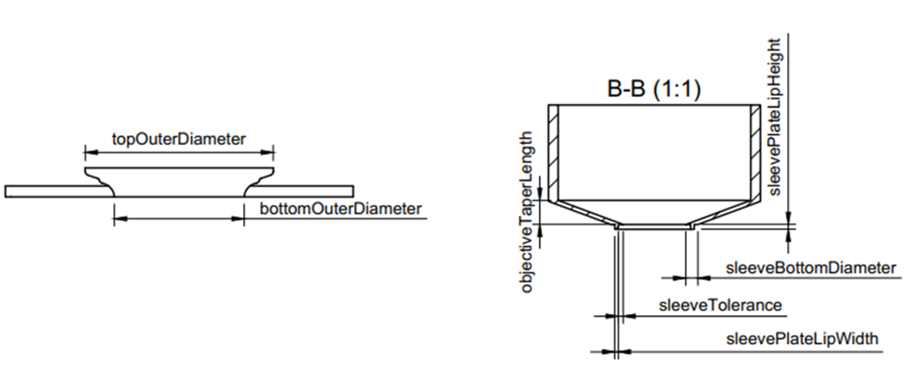

# Headplate and light-blocking sleeve for 2P imaging
This system was designed to provide simple and reliable light shielding for 2-photon imaging in awake head-fixed mice (running on a 3D-treadmill with visual stimulation in our case). With this in mind, we optimized for the following criteria:

* No hand-made or improvised components that can add variability to the data quality of each experiment – so no putty, wax or tape.
* Simple connection between the animal’s headplate and the light shielding around the microscope lens, to prevent having to work close to the animal’s head, which can stress animals and impact task performance.
* Quick fastening mechanism (< 1 minute). Animals only have a limited time span for motivated, focused performance. We want to lose as little as possible of that time on setting up the imaging. Ideally, the time between putting the animal on the treadmill and beginning the first imaging sequence should be well below 10 minutes.
* Easy to ensure watertight seal with the skull to prevent leakage of fluid during imaging.
* Cheap and easy to replace/tweak if necessary.

We came up with a two-part solution. One is a circular headplate with a ring that rises up conically to fit around the microscope lens while providing a fluid reservoir for imaging with water-immersed objectives. The headplate has two connectors/holders on the side that can be used for stable head fixation (similar concept to Poort et al. 2015 Neuron, Havenith et al. 2019 Scientific Reports). It is easy to implant on the skull, and then remains stable and watertight for months.

The second component is a light-absorbing conical sleeve which was designed to fit with an Olympus 20x objective, and can be lowered below the rim of the implanted headplate once the animal is head-fixed under the microscope. Since the sleeve is designed to fit snugly underneath the rim of the headplate’s cone, it doesn’t require any extra fastening mechanisms apart from lowering it past the headplate’s rim, making it extremely quick and easy to use. In our experience, lowering the sleeve all the way to the base of the headplate eliminates all stray light in recordings.

A first version of this design was published as [10.5281/zenodo.4547658](https://zenodo.org/record/4547658#.ZBLb5XbMKUn). The current version is a parametric re-make of v1 that allows you to change relevant dimensions of the designs and adjust them to your needs (e.g. diameter and height of the sleeve).

# Parameters
The design can be altered to your needs by modifying the parameters controlling the relevant dimensions. The table below contains the parameter names, a description of their function and some relevant notes regarding their impact on the design. A graphical representation of the parameters is available in the form of two drawings, one of the [headplate](https://github.com/3Dneuro/HeadplateShield2P/blob/main/design%20files/Headplate%20drawing.pdf) and one of the [sleeve](https://github.com/3Dneuro/HeadplateShield2P/blob/main/design%20files/Sleeve%20drawing.pdf), that can be found in the design files folder (see preview image below). They demonstrate the precise, physical dimensions corresponding to the parameters. These drawings can be used to easily visualize and determine what parameters should be modified for the changes that you wish to make.

## Headplate
| Parameter               | Description                                                                                                       | Notes                                                                                                                                                                                                            |
| ----------------------- | ----------------------------------------------------------------------------------------------------------------- | ---------------------------------------------------------------------------------------------------------------------------------------------------------------------------------------------------------------- |
| bottomInnerDiameter     | The diameter in mm of the opening at the bottom of the headplate                                                  |                                                                                                                                                                                                                  |
| bottomOuterDiameter     | The outer diameter in mm of the bottom of the headplate                                                           |                                                                                                                                                                                                                  |
| topInnerDiameter        | The diameter in mm of the opening at top of the headplate                                                         |                                                                                                                                                                                                                  |
| topOuterDiameter        | The outer diameter in mm of the top of the headplate                                                              | Determines the diameter of the bottom opening in the sleeve as well, ensuring a natural light seal                                                                                                               |
| middleInnerDiameter     | The inner diameter in mm of the hole at the middle of the headplate                                               |                                                                                                                                                                                                                  |
| totalHeight             | The height in mm from the bottom of the headplate to the very top                                                 | Height includes the set height of the lip (topLipHeight)                                                                                                                                                         |
| topLipHeight            | The height in mm of the lip that sits at the top of the headplate                                                 |                                                                                                                                                                                                                  |
| holderLengthFromCenter  | The length in mm of the two holder arms taken with respect to the center of the headplate                         | Solely controls the length of the arms, start of screw openings/slots is not affected                                                                                                                            |
| holderWidth             | The width in mm of the holder arms                                                                                | Does not alter the diameter of the screw openings, can be used to widen or slim the two prongs of each holder                                                                                                    |
| holderOpeninngDiameter  | The diameter in mm of the screw openings in the holder arms                                                       | This determines what size screws should be used to fasten the headplate                                                                                                                                          |
| holderOpeningFromCenter | The distance in mm from the beginning of the screw opening to the center of the headplate                         | Can be used to move the start of the screw openings/slots to or from the center of the headplate                                                                                                                 |
| holderHeight            | The height in mm of the holder arms                                                                               | Height of the holders is limited with respect to the height of the headplate (totalHeight)                                                                                                                       |
| holderAngle             | The angle in degrees of the holder arms with respect to the z midline                                             | Holder configuration can be changed using this parameter. At certain angles, holders can be made to overlap if so desired                                                                                        |

## Sleeve
| Parameter               | Description                                                                                                       | Notes                                                                                                                                                                                                            |
| ----------------------- | ----------------------------------------------------------------------------------------------------------------- | ---------------------------------------------------------------------------------------------------------------------------------------------------------------------------------------------------------------- |
| wallThickness           | The thickness in mm of the walls of the sleeve                                                                    |                                                                                                                                                                                                                  |
| objectiveDiameter       | The inner diameter in mm of the sleeve                                                                            | Using this and objectiveTaperLength, the sleeve can be made to fit specific objectives                                                                                                                           |
| sleeveHeight            | The height in mm of the straight portion of the sleeve (excluding the taper thus)                                 | Can be used to have the sleeve run further up the objective                                                                                                                                                      |
| toleranceSleeve         | The space in mm between the lip on the sleeve and the lip on the headplate                                        | This parameter controls the distance between the sleeve and headplate and thus how well light is sealed out. Less tolerance means less light can reach the opening, however, resutling in less room for movement |
| objectiveTaperLength    | The vertical height in mm of the taper, to be measured from the start of the taper to the bottom of the objective | To ensure a correct fit, measure the distance from the start of the taper on the objective to the bottom as if it were on the midline                                                                            |
| sleeveBottomDiameter    | The outer diameter in mm of the bottom of the sleeve                                                              | Controls the flat area at the bottom of the sleeve, a higher outer diameter increases the surface area upon which the sealing lip is located allowing for more tolerance if needed                               |
| sleevePlateLipWidth     | The width in mm of the sealing lip at the bottom of the sleeve                                                    | The max width dependents on the surface area at the bottom of the sleeve, adjust sleeveBottomDiameter when required to do so                                                                                     |
| sleevePlateLipHeight    | The height in mm of the sealing lip at the bottom of the sleeve                                                   |                                                                                                                                                                                                                  |

# Manufacturing
While the headplate can be produced in a range of materials, we recommend machined aluminum, which is strong enough to ensure stable imaging-compatible head fixation while still being light. For test purposes, printing the headplate in a sturdy plastic can work well.
The sleeve can be made in any opaque plastic, preferably one that is matte/does not reflect stray light, or be machined in aluminum.

# License
> Copyright 3Dneuro 2022.
> This source describes Open Hardware and is licensed under the CERN-OHL-S v2
> You may redistribute and modify this documentation and make products using it under the terms of the CERN-OHL-S v2 (https:/cern.ch/cern-ohl). This documentation is distributed WITHOUT ANY EXPRESS OR IMPLIED WARRANTY, INCLUDING OF MERCHANTABILITY, SATISFACTORY QUALITY AND FITNESS FOR A PARTICULAR PURPOSE. Please see the CERN-OHL-S v2 for applicable conditions.
> Source location: https://www.3dneuro.com/open-hardware/
> https://choosealicense.com/licenses/cern-ohl-s-2.0/
